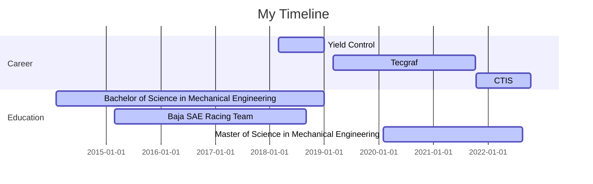

## Hello, I'm Matheus 👋

<!--
- 🔭 I’m currently working on ...
- 🌱 I’m currently learning ...
- 👯 I’m looking to collaborate on ...
- 🤔 I’m looking for help with ...
- 💬 Ask me about ...
- 📫 How to reach me: ...
- 😄 Pronouns: ...
- ⚡ Fun fact: ...
-->

### Connect with Me:
[][linkedin]

 

### Languages and Tools:
[][linkedin]
[][linkedin]
[][linkedin]
[][linkedin]
[][linkedin]

[][linkedin]
[][linkedin]

[][linkedin]
[][linkedin]

[][linkedin]
[][linkedin]

[][linkedin]
[][linkedin]

 
 
<a href='https://github.com/matheus-hoffmann/github-stats-transparent'>
  
 

[linkedin]: https://www.linkedin.com/in/matheus-hoffmann/
